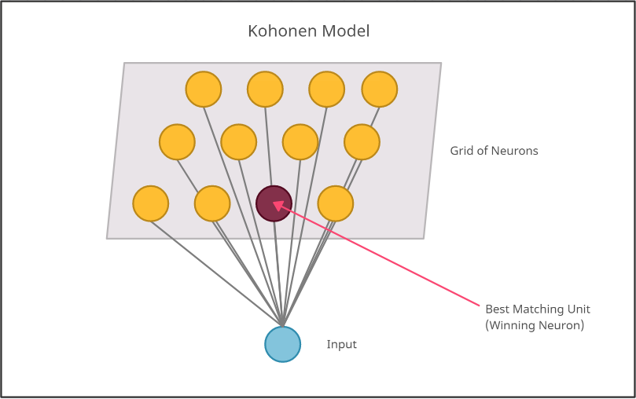
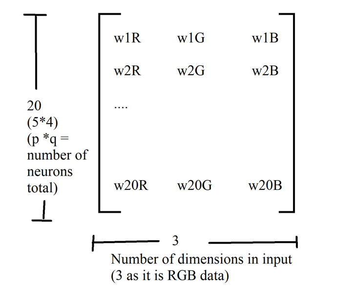

---
title: "SOM"

---

```{css, echo=FALSE}
.center {
   text-align: center;
}

```
---

<div class="center">
  <h1>Self Organizing Maps</h1>
  <h7>R Programming, FOSSEE Team</h7>
</div>

---

```{R echo=TRUE, message=FALSE, warning=FALSE}
#install.packages("DiagrammeR")
library(DiagrammeR)
#install.packages("diagram")
library(diagram)
```


### Introduction to SOM

Self organizing maps are a class of artificial neural networks based on competitive learning that helps to organize and understand high dimensional data by reducing the number of dimensions from a high dimensional space to a 2 D map. With SOM, clustering is performed by having several units compete for the current object. Once the data have been entered into the system, the newtwork of artificial neurons is trained by providing information about inputs. The weight vector of the unit is closest to the current object becomes the winning or active unit. During the training stage, the values for the input variables are gradually adjusted in an attempt to preserve neighborhood relationships that exist within the input data set. As it gets closer to the input object, the weights of the winning unit are adjusted as well as its neighbors.

<div class="center">

</div>  

#### Competitive Learning
The model utilizes using unsupervised learning to map the input through competitive learning in which the output neurons compete amongst themselves to be activated, with the result that only one is activated at any one time. Getting the Best Matching Unit is done by running through all wright vectors and calculating the distance from each weight to the sample vector. The weight with the shortest distance is the winner. There are numerous ways to determine the distance, however, the most commonly used method is the Euclidean Distance and/or Consine Distance.Due to the negative feedback connections between the neurons,  the neurons are forced to organise themselves which gave rise to the name Self Organizing Map (SOM).

<div class="center">

</div>  


### Algorithm

```{R echo=TRUE, fig.width=25, fig.height=40, message=FALSE, warning=FALSE}
library(DiagrammeR)


openplotmat(main = "textbox shapes")
 rx <- 0.2
 ry <- 0.05
pos <- coordinates(c(1,1,1,1,1,1,1 ), mx = -0.00001)
fromto <- matrix(ncol = 2, byrow = TRUE,  data = c(1, 2, 2, 3, 3,4,4,5,5,6,6,7))
nr <- nrow(fromto)

arrpos <- matrix(ncol = 2, nrow = nr) 
for (i in 1:nr)
{arrpos[i, ] <- straightarrow (to = pos[fromto[i, 2], ],
from = pos[fromto[i, 1], ],
lwd = 2, arr.pos = 0.6, arr.length = 0.5)
}
segmentarrow (from = pos[6, ], to = pos[3, ], lty = 1, lcol = 1)
textround(mid = pos[1,], radx = rx, rady = ry, lab = "Start", cex = 2, shadow.col = "black")
textdiamond(mid = pos[2,], radx = rx, rady = ry, lab = "Initialization", cex = 2, shadow.col = "lightblue")
textrect(mid = pos[3,], radx = rx, rady = ry, lab = "Sampling", cex = 2, shadow.col = "darkred")
textrect(mid = pos[4,], radx = rx, rady = ry, lab = "Competition", cex = 2, shadow.col = "darkred")
textrect(mid = pos[5,], radx = rx, rady = ry, lab = "Cooperation", cex = 2, shadow.col = "darkred")
textrect(mid = pos[6,], radx = rx, rady = ry, lab = "Adaptation", cex = 2, shadow.col = "darkred")
textround(mid = pos[7,], radx = rx, rady = ry, lab = "End", cex = 2, shadow.col = "black")


```

### ALGORITHM

- Initialization - Create a grid of neurons and randomly initialize weights.
- Sampling- Select a random row (vector) from input data.
- Competition- Neurons fight to become the Best Matching Unit which is determined using the discriminant function.
- Cooperation- The winning neuron determines the spatial location of a topological neighbourhood of excited neurons which will cooperate.
- Adaptation- Weights are adjusted with respect to winning neuron, such that a similar input pattern is enhanced.
- We will go back to step 2 and keep repeating the process till the map stops changing or convergence is achieved.


### Guided Tutorial in R


##### Initialization 

Create a grid of neurons and randomly initialize weights. The neurons are represented by weight vectors of same dimensions as input. The random numbers are generated using the runif function which accepts the number of random numbers to be generated as input.

Code snippet:


```{R echo=TRUE, message=FALSE, warning=FALSE}
#Let's create a matrix of 10 rows and 5 columns
t <- matrix(runif(50, min=0, max=255), nrow = (10), ncol = 5)
t
```

##### Sampling

Select a random row (vector) from input data. The sampling is done using the sample() function in R which retrieves an input row.


```{R echo=TRUE, message=FALSE, warning=FALSE}
i <- sample(t, 1, replace = F)
i
```

##### Competition

Neurons fight to become the Best Matching Unit which is determined using the discriminant function.Here our discriminant function is Euclidean distance given by the formula:


<body>
\begin{equation}
 d\left( p,q\right) = \sqrt {\sum _{i=1}^{n}  \left( q_{i}-p_{i}\right)^2 } 
 \end{equation}
</body>


```{R echo=TRUE, message=FALSE, warning=FALSE}

#Lets make a function to calculate euclidean distance.
euclidean <- function(a, b) sqrt(sum((a - b)^2))

#Let's run this on a sample input

euclidean(2,4)
```

##### Cooperation

The winning neuron determines the spatial location of a topological neighbourhood of excited neurons which will cooperate.

```{R echo=TRUE, message=FALSE, warning=FALSE}
# Defining a function to calculate the neighbourhood using the radius of neighbourhood and lateral distance.
neighbourhood <- function(distance,radius) exp(-(distance**2)/(2*(radius**2)))

# Calculating sample neighbourhood for lateral distance 2 and radius 4.
neighbourhood(2,4)
```

#####  Adaptation

Weights are adjusted with respect to winning neuron, such that a similar input pattern is enhanced.

```{R echo=TRUE, message=FALSE, warning=FALSE}

#Two functions for the decaying learning rate and sigma
decay_radius <- function (init_radius,i,time_constant) init_radius*exp(-i/time_constant)
decay_learning_rate <- function(init_learning_rate,i,n_iter) init_learning_rate* exp(-i/n_iter)

# Calculate radius of neighborhood at a time 4, with radius 3 and at the 4th iteration
decay_radius(4,4,3)

#Calculating the learning rate of model at the 3rd iteration out of a total of 100 iterations and initial learning rate of 0.1.
decay_learning_rate(0.1,3,100)

```


###  Implementation


#### Step 1: Data Generation

For this tutorial, we will demonstrate the working of SOM on RGB dataset of 10000 rows. We will create this dataset by random generation of vectors.

<B>Code Snippet</B>

```{R echo=TRUE, message=FALSE, warning=FALSE}

set.seed(11)
#### generate some RGB data ####
## select the number of random RGB vectors for training data
size_data <- 10000
## generate dataframe of random RGB vectors
n <- 3 #n is the number of input dimensions
sample <- as.data.frame(matrix(nrow = size_data, ncol = n))
colnames(sample) <- paste0("a" , 1:n)
for(i in 1:n) #iterating over columns
{  sample[,i]<- sample(0:255, size_data, replace = T) #RGB data of 10000 rows
}

View(sample)

# Change the data frame with training data to a matrix
# Also center and scale all variables to give them equal importance during
# the SOM training process. 
#data_train_matrix <- as.matrix(scale(sample))
data_train_matrix <- as.matrix(sample)
```


#### Step 2: Initialization

The SOM is in its essence a grid of neurons, each neuron containing a weight vector and a position i,j in the grid. We begin by assigning random values for the initial weight vectors w. The dimensions of the weight vector are equal to the number of input dimensions.


<div class="center">

</div> 

<div class="center">

</div> 
<B>Code Snippet</B>

```{R echo=TRUE, message=FALSE, warning=FALSE}

#Now lets initialize the weights of the neural network.
#Creating a p x q neural network.
p <- 5
q <- 4

weights_matrix <- matrix(runif(p*q*n, min=0, max=255), nrow = (p*q), ncol = n)

colnames(weights_matrix) <-  colnames(data_train_matrix)
```


#### Step 3: Best Matching Unit 

The SOM works using competitive learning which selects a best matching unit at each iteration using the discriminant function value closest to the randomly sampled input vector. 


<div class="center">

</div>

<B>Code Snippet</B>

```{R echo=TRUE, message=FALSE, warning=FALSE}

#Lets make a function to calculate euclidean distance.
euclidean <- function(a, b) sqrt(sum((a - b)^2))

#As a part of competition process we need to find BMU. So let's create function to find BMU.

find_bmu <- function(random_input)
{
  
  min_dist=1000000
  min_index = 0
  
  for (i in 1:length(1:(p*q)))
  {
    if (euclidean(weights_matrix[i,],random_input) < min_dist)
    {
      min_dist <- euclidean(weights_matrix[i,],random_input)
      min_index <- i
    }
    
    
  }
  return(min_index)
  
}
```


#### Step 4: Training the SOM.

The SOM follows the algorithm mentioned above to fit the training data till the map stops changing or in other words till the model converges. 

<B>Code Snippet</B>

```{R echo=TRUE, message=FALSE, warning=FALSE}

#Defining the training parameters
n_iter=2000
init_learning_rate=0.1
init_radius=max(p,q)/2
time_constant=n_iter/log(init_radius)

#Three functions for the decaying learning rate, sigma and neighbourhood
decay_radius <- function (init_radius,i,time_constant) init_radius*exp(-i/time_constant)
decay_learning_rate <- function(init_learning_rate,i,n_iter) init_learning_rate* exp(-i/n_iter)
neighbourhood <- function(distance,radius) exp(-(distance**2)/(2*(radius**2)))

input_indices <- 1:size_data

for (i in 1:n_iter)
{
  
  #Randomly selecting input row from given dataset
  current_row_index <- sample(input_indices, 1, replace = F)
  random_input_row <- data_train_matrix[current_row_index,]
  
  r <- decay_radius(init_radius,i,time_constant)
  l <- decay_learning_rate(init_learning_rate,i,n_iter)
  bmu_idx <- find_bmu(random_input_row)
  bmu_row <- bmu_idx/q
  bmu_col <- bmu_idx%%q
  
  
  for (x in 1:p)
  {
    for (y in 1:q)
    {
      lateral_distance <- euclidean(c(x,y), c(bmu_row, bmu_col))
      neighbourhood_current <- neighbourhood(lateral_distance, r)
      old_weight <- weights_matrix[q*(x-1)+y,]
      new_weight <- old_weight + (l*neighbourhood_current*(random_input_row-old_weight))
      for(t in 1:n)
      {
      weights_matrix[q*(x-1)+y,t] <- as.numeric(new_weight[t])
      }
    
    }
  }
  
  
}


ddf<- as.data.frame(weights_matrix)


View(ddf)

```


### Visualization of results

As we are using RGB data in this example, we are directly visualizing the data of 3 colours as points on a grid. Two dimensions are plotted on a hex scale and everything is converted to one dimension to plot all the points.

```{R echo=TRUE, message=FALSE, warning=FALSE, include=FALSE}
colors <- sample
colnames(colors) <- c("red","green","blue")
colors$red <- as.numeric(colors$red)
colors$green <- as.numeric(colors$green)
colors$blue <- as.numeric(colors$blue)
colors$hex = rgb(colors$red, colors$blue, colors$green, maxColorValue = 255)

View(colors)

# Map each color to an x-coordinate for easy plotting.
colors2d <-sapply(1:nrow(colors), function(row) {
  color <- colors[row,]
  (color$red * 256 * 256) + (color$green * 256) + color$blue
})
colors$x <- colors2d


# Plot the colors - the more data, the more apparent the gradient will be.
plot(x=colors$x, col=colors$hex, pch=19, cex=2, main='Colors', xlab='', ylab='2D Color', yaxt='n', xaxt='n')

```

```{R echo=TRUE, message=FALSE, warning=FALSE}
colors <- sample
colnames(colors) <- c("red","green","blue")
colors$red <- as.numeric(colors$red)
colors$green <- as.numeric(colors$green)
colors$blue <- as.numeric(colors$blue)
colors$hex = rgb(colors$red, colors$blue, colors$green, maxColorValue = 255)

View(colors)

# Map each color to an x-coordinate for easy plotting.
colors2d <-sapply(1:nrow(colors), function(row) {
  color <- colors[row,]
  (color$red * 256 * 256) + (color$green * 256) + color$blue
})
colors$x <- colors2d


# Plot the colors - the more data, the more apparent the gradient will be.
plot(x=colors$x, col=colors$hex, pch=19, cex=2, main='Colors', xlab='', ylab='2D Color', yaxt='n', xaxt='n')


```

```{R echo=TRUE, message=FALSE, warning=FALSE}
colors <- ddf
colnames(colors) <- c("red","green","blue")
colors$red <- as.numeric(colors$red)
colors$green <- as.numeric(colors$green)
colors$blue <- as.numeric(colors$blue)
colors$hex = rgb(colors$red, colors$blue, colors$green, maxColorValue = 255)

View(colors)

# Map each color to an x-coordinate for easy plotting.
colors2d <-sapply(1:nrow(colors), function(row) {
  color <- colors[row,]
  (color$red * 256 * 256) + (color$green * 256) + color$blue
})
colors$x <- colors2d


# Plot the colors - the more data, the more apparent the gradient will be.
plot(x=colors$x, col=colors$hex, pch=19, cex=2, main='Colors', xlab='', ylab='2D Color', yaxt='n', xaxt='n')


```
