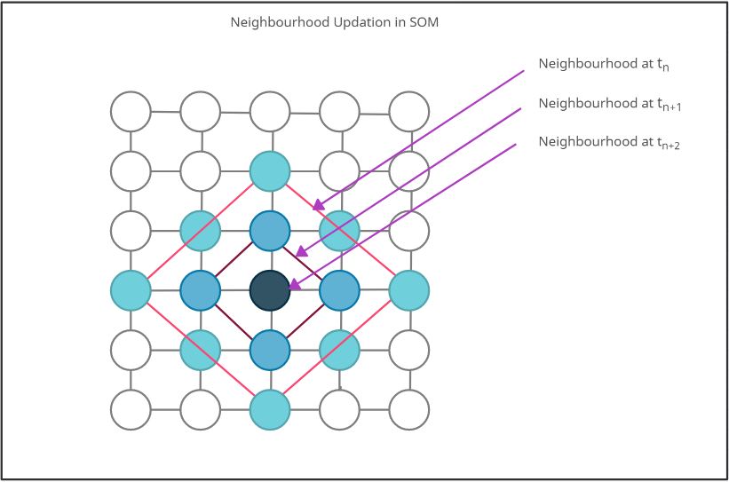
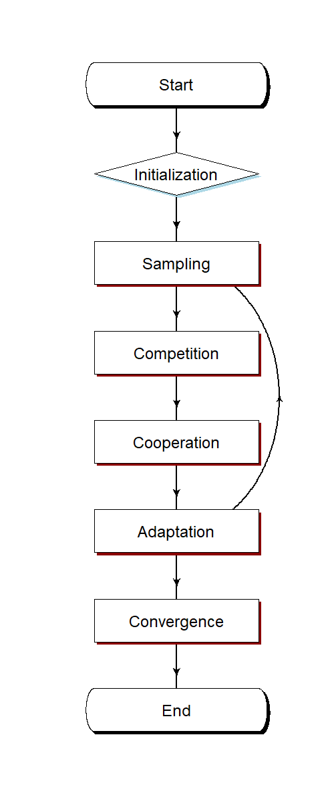
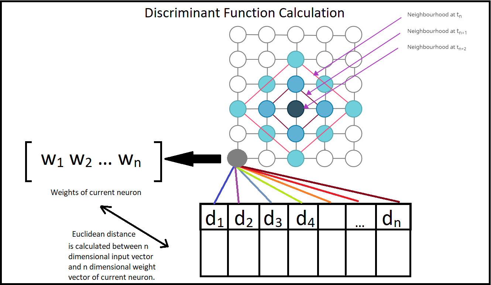
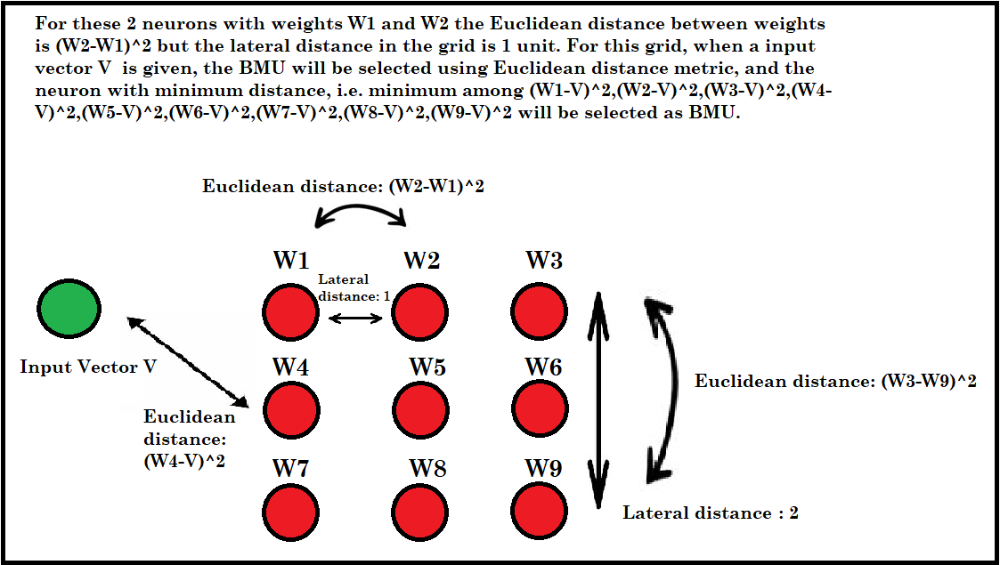

```{r setup, include=FALSE}
knitr::opts_chunk$set(echo = TRUE)
```
[Return To Home Page](Start_here.html)

```{css, echo=FALSE}
.center {
   text-align: center;
}

```

---

<div class="center">
  <h1>Module 1</h1>
  <h3>Introduction to Self Organizing Maps</h3>
</div>


---


```{R echo=TRUE, message=FALSE, warning=FALSE, include=FALSE}
library(DiagrammeR)
library(diagram)
```
# Table of Contents 

  - <a href="#lession1">Chapter 1: Introduction to SOM</a><br />
  - <a href="#lession2">Chapter 2: Algorithm</a><br />
  - <a href="#lession3">Chapter 3: Guided Tutorial in R</a><br />
  -- <a href="#t1">3.1: Initialization</a><br />
  -- <a href="#t2">3.2: Sampling</a><br />
  -- <a href="#t3">3.3: Competition</a><br />
  -- <a href="#t4">3.4: Cooperation</a><br />
  -- <a href="#t5">3.5: Adaptation</a><br />
  - <a href="#lession4">Chapter 4: Implementation</a><br />
    -- <a href="#t1">4.1: Data Generation</a><br />
  -- <a href="#t2">4.2: Initialization</a><br />
  -- <a href="#t3">4.3: Best Matching Unit (BMU)</a><br />
  -- <a href="#t4">4.4:Training the SOM</a><br />
  - <a href="#lession5">Chapter 5: Optimization in R</a><br />
  - <a href="#lession6">Chapter 6: Running the model over multiple epochs </a><br />
  - <a href="#lession7">Chapter 7: References</a><br />
    
    
    
<a id="lession1"></a>

## Chapter 1: Introduction to SOM 
<div align="justify"> 

Self organizing maps are a type of artificial neural network based on competitive learning that work by reducing the number of dimensions from a high dimensional space to a 2 D map.  Once the data is fed to the system, a grid of artificial neurons is trained by providing information about inputs, one input at a time. Neurons compete with each other to be the weight vector of the unit is closest to the current given input, which is also called the winning or Best Matching Unit(BMU). During the training stage, the values for the input variables are gradually adjusted in an attempt to preserve neighbourhood relationships that exist within the input data set. As it gets closer to the input object, the weights of the winning unit are adjusted as well as its neighbours [@a1]. With every training iteration, the neighbourhood of the BMU gets smaller and the learning rate decays as the weights slowly converge to form a map that represents the input space. The self organizing map provides this representation as the result of training which can be used to understand the data better with the reduced dimensionality [@a2,@a3].

Understanding how the SOM learns representations without any hidden layers was an important challenge faced by us while creating this tutorial. The SOM, unlike most popular neural networks learns from the input data using a single grid of neurons which adapt and cooperate to form the final representation. This mechanism of cooperation and competition is highly interesting and the effectiveness of the algorithm in dimensionality reduction can be seen in the following modules of this series.

<div class="center">


</div>  

#### Competitive Learning
The model utilizes using unsupervised learning to map the input through competitive learning in which the output neurons compete amongst themselves to be activated, with the result that only one is activated at any one time. Getting the BMU is done by running through all weight vectors and calculating the distance from each weight to the sample vector. The weight with the shortest distance from the input is the winner. There are numerous ways to determine the distance, however, the most commonly used method is the Euclidean Distance and/or Cosine Distance. The function used to evaluate the BMU is also called the discriminant function. In this tutorial, the Euclidean distance has been used as the discriminant function. Due to the negative feedback connections between the neurons,  the neurons are forced to organise themselves which gave rise to the name Self Organizing Map (SOM)  [@a4,@a5,@a6,@a7,@a8,@a9].

There are several distance functions in mathematics like the Manhattan distance, Minkowski distance and Hamming distance. In this tutorial, we employed the Euclidean distance as it is more intuitive for learners to understand and applicable for vectors of lower dimensions. The users of this tutorial can experiment with new distance functions and observe the difference in SOMs for each function.

<div class="center">

</div>  

<a id="lession2"></a>

## Chapter 2: Algorithm

```{R echo=TRUE, fig.width=25, fig.height=40, message=FALSE, warning=FALSE , include=FALSE}
png("Resources/flowchart.png", width = 500, height = 1200)
openplotmat(main = "")
 rx <- 0.3
 ry <- 0.03
pos <- coordinates(c(1,1,1,1,1,1,1,1 ), mx = -0.00001)
fromto <- matrix(ncol = 2, byrow = TRUE,  data = c(1, 2, 2, 3, 3,4,4,5,5,6,6,7,7,8))
nr <- nrow(fromto)

arrpos <- matrix(ncol = 2, nrow = nr) 
for (i in 1:nr)
{arrpos[i, ] <- straightarrow (to = pos[fromto[i, 2], ],
from = pos[fromto[i, 1], ],
lwd = 2, arr.pos = 0.6, arr.length = 0.5)
}
curvedarrow (from = pos[6, ], to = pos[3, ],lwd = 2, lty = 1)
textround(mid = pos[1,], radx = rx, rady = ry, lab = "Start", cex = 2, shadow.col = "black")
textdiamond(mid = pos[2,], radx = rx, rady = ry, lab = "Initialization", cex = 2, shadow.col = "lightblue")
textrect(mid = pos[3,], radx = rx, rady = ry, lab = "Sampling", cex = 2, shadow.col = "darkred")
textrect(mid = pos[4,], radx = rx, rady = ry, lab = "Competition", cex = 2, shadow.col = "darkred")
textrect(mid = pos[5,], radx = rx, rady = ry, lab = "Cooperation", cex = 2, shadow.col = "darkred")
textrect(mid = pos[6,], radx = rx, rady = ry, lab = "Adaptation", cex = 2, shadow.col = "darkred")
textrect(mid = pos[7,], radx = rx, rady = ry, lab = "Convergence", cex = 2, shadow.col = "darkred")
textround(mid = pos[8,], radx = rx, rady = ry, lab = "End", cex = 2, shadow.col = "black")
dev.off()
```

<div class="center">

</div>
### Steps: 

1. Initialization - Create a grid of m x n neurons where m and n are random integers that correspond to the number of rows and columns of neurons in the grid. This number depends on the nature of input data and the ideal value should be determined through trial and error during experimentation.  Now randomly initialize the weights of neurons in the grid. For more details about this step of the algorithm, refer to section 3.1 of this module.
2. Sampling- Select a random row (vector) from input data. For more details about this step of the algorithm, refer to section 3.2 of this module.
3. Competition- Neurons fight among themselves to become the BMU which is determined using the discriminant function. For more details about this step of the algorithm, refer to section 3.3 of this module.
4. Cooperation- The winning neuron determines the spatial location of a topological neighbourhood of excited neurons which will cooperate. For more details about this step of the algorithm, refer to section 3.4 of this module.
5. Adaptation- Weights are adjusted with respect to winning neuron, such that a similar input pattern is enhanced. For more details about this step of the algorithm, refer to section 3.5 of this module.
6. Go back to Step 2-Sampling and keep repeating the process till the map stops changing or convergence is achieved. For more details about this step of the algorithm, refer to Chapter 6 of this module.

These steps summarize the basic functioning of the SOM algorithm proposed by Kohonen and have been concisely defined after a comprehensive evaluation of different adaptations of the SOM algorithm carried out by us. We implemented the m x n grid of neurons as a n x n square grid. In many papers we found variations of the original algorithm which were created for different applications and optimizations, but we incorporated the commonly followed procedure in this tutorial. There was a lot of trial and error involved in executing these steps in R, as there was not an abundance of open-source material about prior implementation of the SOM algorithm purely in R that was accessible as a reference. 

<a id="lession3"></a>

## Chapter 3: Guided Tutorial in R


<a id="t1"></a>

### 3.1: Initialization 

Create a grid of neurons and randomly initialize weights. The neurons are represented by weight vectors of same dimensions as input. The random numbers are generated using the rnorm function which generates normal random numbers that typically lie in the range of -4 to 4.

Code snippet:


```{R echo=TRUE, message=FALSE, warning=FALSE}
# 3.1.1) Creating a matrix called "grid" with 10 rows and 5 columns.
rows = 10
columns = 5
grid <- matrix(data = rnorm(rows*columns),  nrow = (rows), ncol = columns)
grid

```

Prior to implementing this step in R, we discussed the implications of a random initialization of weights in detail. While several paper mention the advantages of initializing the weights in close range of input vectors within the given space, we stuck to random initialization for a generic implementation of the initialization step. 

<a id="t2"></a>

### 3.2:  Sampling

Select a random row (vector) from input data. The sampling is done using the sample() function in R which retrieves a random value from the data provided to it. In this example, we will pass the list of row numbers to this function from which it will sample a random row number. Then we extract this row from the data matrix using indexing.


```{R echo=TRUE, message=FALSE, warning=FALSE}
# 3.2.1) Sampling a random row from an input data matrix called "data".
data <- matrix(data = rnorm(6),  nrow = (2), ncol = 3)
sample_input_row <- as.vector(unlist(data[sample(1:nrow(data), size = 1, replace = F), ])) 
sample_input_row
```

<a id="t3"></a>


### 3.3:  Competition

Neurons fight among themselves to become the BMU which is determined using the discriminant function.Here our discriminant function is Euclidean distance given by the formula:


<body>
\begin{equation}
 d\left( x,y\right) = \sqrt {\sum _{i=1}^{n}  \left( y_{i}- x_{i}\right)^2 } 
 \end{equation}
 <center> Equation 1: Euclidean distance formula</center><br><br><br><br>
 where $x$ and $y$ are the vectors in n dimensional space  and $x_{i}$ and $y_{i}$ are the values of the $i {th}$ vector coordinates.

</body>


```{R echo=TRUE, message=FALSE, warning=FALSE}
# 3.3.1) Creating a function to calculate euclidean distance.
euclidean_distance <- function(x, y) {
  ret <- sum((x - y)^2)
  return(ret)
}

# Let's run this on a sample input.
x <- c(2,3,4)
y <- c(1,7,9)
euclidean_distance(x,y)
```


The BMU is the neuron which is closest to the input vector. The discriminant function is used to calculate this distance between all the neurons' weights and the input vector.

<div class="center">

</div>


```{R echo=TRUE, message=FALSE, warning=FALSE}
# 3.3.2) Defining the BMU function with parameters where "x" is a single input row of data and "input_grid" is the grid.
BMU <- function(x, input_grid) { 
  distance <- 0
  min_distance <- 10000000 # Initialize the minimum distance to any very large value with respect to the grid neurons' weights' distances.
  min_ind <- -1 
  # Iterating through grid.
  for (e in 1:nrow(input_grid))
  {
    # Distance calculation.
    distance <- euclidean_distance(x, input_grid[e, ]) 
    if (distance < min_distance) {
      # Updating minimum distance for winning unit.
      min_distance <- distance 
      # Updating winning neuron.
      min_ind <- e 
    }
  }
  # Returns index of BMU.
  return(min_ind-1) 
}
```

While creating the BMU function, we needed to understand how the best neuron is decided using the distance metric. As the input is randomly sampled in each iteration, we wrapped the process of competition between neurons in a separate function for readability and ease. We decided to use the Euclidean distance as a distance metric for deciding the best neuron, and calculated the neuron with minimal distance from input as the winner. It seems counter-intuitive to randomly sample input as one may think that the map will keep changing dynamically each time a new input is sampled and will never converge, but this problem will be solved in the next steps of the algorithm. 


<a id="t4"></a>


### 3.4:  Cooperation

The winning neuron determines the spatial location of a topological neighbourhood of excited neurons which will cooperate.


<body>
\begin{equation}
 influence = exp(-(distance^{2}) / (2 * (radius^{2}))) 
 \end{equation}
  <center> Equation 2: Neighbourhood influence calculation formula</center><br><br>
 where $distance$ is the lateral distance between neurons in the grid and  $radius$ is the radius of influence over which a BMU influences its neighbourhood.
 
 
Note: Remember that this lateral distance between neurons in the grid is completely different from the Euclidean distance between weights and input vector. Refer to figure 5 to understand the difference between the lateral distance and discriminant function distance.

<div class="center">

</div> 

</body>

```{R echo=TRUE, message=FALSE, warning=FALSE}
# 3.4.1) Defining a function to calculate the neighbourhood influence using the radius of neighbourhood and lateral distance.
influence_calculation <- function(distance, radius) {
  ret <- exp(-(distance^2) / (2 * (radius^2)))
  return(ret)
}

# Calculating sample neighbourhood for lateral distance 2 and radius 4.
lateral_distance <- 2
radius <- 4
influence_calculation(lateral_distance,radius)
```
Understanding the difference between the lateral Euclidean distance between neurons in the grid,  and the Euclidean distance between an input vector and neurons was the one of the most difficult parts of implementing this algorithm. Without the clear distinction between the distances, it is difficult to understand how the SOM truly learns representations. This concept is key to how the algorithm is able to represent the highly dimensional input data with a simple 2D grid of neurons, as the lateral distance between the neurons defines the neighbourhood for adaptation while the Euclidean input vector distance defines the criteria for competition.

<a id="t5"></a>


### 3.5:  Adaptation

Weights are adjusted with respect to winning neuron, such that a similar input pattern is enhanced.


<body>
\begin{equation}
 new\_radius = radius * exp(-current\_iteration / time\_constant) 
 \end{equation}
 
  <center> Equation 3: Radius decay formula</center><br><br>
 where $radius$ is the initial radius of neighbourhood, $current\_iteration$ is the iteration of data sampling that we are currently on and  $time\_constant$ is the time constant which is incremented at each iteration, when the SOM gets updated.

 <\body>
 
 
```{R echo=TRUE, message=FALSE, warning=FALSE}
# 3.5.1) Function for the decaying radius for a given iteration "current_iteration".
decay_radius_function <- function(radius, current_iteration, time_constant) {
  ret <- radius * exp(-current_iteration / time_constant)
  return(ret)
}

# Calculate radius of neighbourhood with the time constant 4, with initial radius 3 and at the 4th iteration.
time_constant <- 4
initial_radius <- 3
iteration_number <- 4
decay_radius_function(initial_radius,iteration_number,time_constant)
```

 <body>
 \begin{equation}
 new\_lateral\_distance = learning\_rate * exp(-current\_iteration / n\_iteration)
 \end{equation}
  <center> Equation 4: Learning rate decay formula</center><br><br>
 where $learning\_rate$ is the old learning rate to be updated, $current\_iteration$ is the iteration of data sampling that we are currently on  and  $n\_iteration$ is the total number of iterations the SOM is trained over.

</body>


```{R echo=TRUE, message=FALSE, warning=FALSE}
# 3.5.2) Function for the decaying learning rate.
decay_learning_rate <- function(learning_rate, current_iteration, n_iteration) {
  ret <- learning_rate * exp(-current_iteration / n_iteration)
  return(ret)
}

# Calculating the learning rate of model at the 3rd iteration out of a total of 100 iterations and initial learning rate of 0.1.
initial_learning_rate <- 0.1
current_iteration <- 3
total_iterations <- 100
decay_learning_rate(initial_learning_rate,current_iteration,total_iterations)
```

This is used to reduce the radius of the neighbourhood around the neuron. This is one of the most important parts of the SOM algorithm - the model works such that after a few iterations only the winning neuron needs to be updated. The decay is done exponentially in accordance with the algorithm proposed by Kohonen. The decaying radius allows the map to represent data points of similar magnitude but spread across different locations in the input space. The radius allows each winning neuron to update its neighbouring neurons closer to input vector, in smaller, more precise neighbourhoods in each iteration. Thus the decaying radius allows the map to get more precise with each iteration so that the neurons distinctly represent input patterns. The decaying learning rate assists in optimization.

<a id="lession4"></a>


## Chapter 4:  Implementation

<a id="e1"></a>

### 4.1: Loading the dataset

For this tutorial, we will demonstrate the working of SOM on a sample dataset[@p1] of 3 dimensions. The dataset consists of admission parameters with the target variable of admit indicating whether the student was admitted or not. We will load this dataset[@p1] from the working directory. We will also import the necessary libraries.

<B>Code Snippet</B>

```{R echo=TRUE, message=FALSE, warning=FALSE}
set.seed(222)
library(dplyr)

# 4.1.1) Reading the data and scaling it.
data <- read.csv("Resources/binary.csv", header = T)
X <- scale(data[, -1])
data <- X
```

<a id="e2"></a>


### 4.2: Initialization

The SOM is in its essence a grid of neurons, each neuron containing a weight vector and a position i,j in the grid. We begin by assigning random values for the initial weight vectors w. The dimensions of the weight vector are equal to the number of input dimensions.


<div class="center">

</div> 

The SOM grid consists of neurons containing p weights each put into a vector, where p is the number of variables in the dataset. This function initially created a data frame, but it transpires that a matrix is a lot faster for all the operations that will be performed. The end result of this function is a 1-D grid of n^2 rows, a flattened version of the original n*n SOM weight matrix. Each neuron has randomly initialised weights that will later be modified by the SOM operations. 

<B>Code Snippet</B>


```{R echo=TRUE, message=FALSE, warning=FALSE}
# 4.2.1) Now let's initialize the weights of the neural network. Creating a 3x3 neural network with 3 dimensions to match the input.

# -----------------------------------------------------
# This is Step 1 of the Algorithm: Initialization
# -----------------------------------------------------

create_grid <- function(n,p) {
  ret <- matrix(data = rnorm(n * p), nrow = n, ncol = p)
  return(ret)
}
grid <- create_grid(9,3)
grid

# -----------------------------------------------------
# This is Step 2 of the Algorithm: Sampling
# -----------------------------------------------------

# NOTE: Kindly refer to the Step 5 of the algorithm.
```


<a id="e3"></a>

### 4.3: Best Matching Unit (BMU)

The SOM works using competitive learning which selects a best matching unit at each iteration using the discriminant function value closest to the randomly sampled input vector. 
This function computes the best matching unit i.e. the winning neuron whose weights are most similar to the new data point that has been passed as input. This is the initial implementation of the function with no optimization. It loops through the entire grid and stores the neuron with the least difference from the data point. Finally, the index of the winning neuron is returned. 


<B>Code Snippet</B>

```{R echo=TRUE, message=FALSE, warning=FALSE}
# -----------------------------------------------------
# This is Step 3 of the Algorithm: Competition
# -----------------------------------------------------

# 4.3.1) Using the "euclidean_distance" function for finding BMU.
euclidean_distance <- function(x, y) {
  ret <- sum((x - y)^2)
  return(ret)
}

# 4.3.2) "BMU" Function to return winning neuron.
BMU <- function(x, input_grid) { 
  distance <- 0
  min_distance <- 10000000 
  min_ind <- -1 
  # Iterating through grid.
  for (e in 1:nrow(input_grid))
  {
    # Distance calculation.
    distance <- euclidean_distance(x, input_grid[e, ]) 
    if (distance < min_distance) {
      # Updating minimum distance for winning unit.
      min_distance <- distance 
      # Updating winning neuron.
      min_ind <- e 
    }
  }
  # Returns index of BMU.
  return(min_ind-1) 
}
```


<a id="e4">  </a>


### 4.4: Training the SOM.

The SOM follows the algorithm mentioned above to fit the training data till the map stops changing or in other words till the model converges.This is the main function that uses all the previously defined functions to implement the Self Organizing Map. Through a number of user-defined epochs, the algorithm randomly draws a data point from the data set and finds the winning neuron. It then computes the neighbourhood using the radius function and updates the weights according to influence and present learning rate. The algorithm terminates when there is no change between the previous set of weights and the new ones generated after one iteration. 

<B>Code Snippet</B>

```{R echo=TRUE, message=FALSE, warning=FALSE}


# -----------------------------------------------------
# This is Step 4 of the Algorithm: Cooperation
# -----------------------------------------------------

# 4.4.1) Function to calculate the decaying learning rate at a particular iteration.
decay_learning_rate <- function(learning_rate, current_iteration, n_iteration) {
  ret <- learning_rate * exp(-current_iteration / n_iteration)
  return(ret)
}

# -----------------------------------------------------
# This is Step 5 of the Algorithm: Adaptation
# -----------------------------------------------------

# 4.4.2) Function to calculate the decaying radius at a particular iteration.
decay_radius_function <- function(radius, current_iteration, time_constant) {
  ret <- radius * exp(-current_iteration / time_constant)
  return(ret)
}

# 4.4.3) Function to calculate influence of BMU over neighbouring neurons.
influence_calculation <- function(distance, radius) {
  ret <- exp(-(distance^2) / (2 * (radius^2)))
  return(ret)
}

# 4.4.4) Creating a function to train SOM.
SOM <- function(x, input_grid) {
  # Defining the training parameters -
  # Defining number of iterations.
   n_iteration <- 400 
  # Defining initial learning rate.
  initial_learning_rate <- 0.05 
  # Defining initial radius.
  initial_radius <- 3 
  # Initializing time constant.
  time_constant <- n_iteration / log(initial_radius) 
  # Initializing physical locations of neurons to figure out lateral distance.
  lateral_distance_points=expand.grid(1:sqrt(nrow(input_grid)),1:sqrt(nrow(input_grid)))
  # Taking the square root of the number of rows of the square grid.
  rows=sqrt(nrow(input_grid)) 
  # Defining the number of epochs.
  n_epochs=10 
  for(ne in 1:n_epochs)
  {
    print(ne)
    old_grid=input_grid
    # Looping through for training.
    for (i in 1:n_iteration) 
    {
      
      # -----------------------------------------------------
      # This is Step 2 of the Algorithm: Sampling
      # -----------------------------------------------------

      # Selecting random input row from given data set.
      sample_input_row <- as.vector(unlist(x[sample(1:nrow(x), size = 1, replace = F), ])) 
      # Decaying the radius.
      new_radius <- decay_radius_function(initial_radius, i, time_constant) 
      # Decaying the learning rate.
      new_learning_rate <- max(decay_learning_rate(initial_learning_rate, i, n_iteration), 0.01) 
       # Finding BMU for given input row.
      index_temp <- BMU(sample_input_row, input_grid)
      # Converting a 1D co-ordinate to a 2D co-ordinate to find the lateral distance on the map.
      index_new=c((as.integer(index_temp/rows))+1,(index_temp%%rows)+1) 
      # Finding euclidean distance between the given BMU and all other units on the map.
      lateral_distance=sqrt(rowSums(sweep(lateral_distance_points,2,index_new)^2)) 
      # Finding neurons that are within the radius of the winning unit.
      rn=which(lateral_distance<=new_radius)
      # Calculating the influence of the winning neuron on neighbours.
      inf=influence_calculation(lateral_distance[rn],new_radius) 
      # A temporary matrix that stores the difference between the data point and the weights of the winning neuron & neighbours.
      diff_grid=(sweep(input_grid[rn,],2,sample_input_row))*-1
      # Updating operation on the winning and neighbouring neurons.
      updated_weights=new_learning_rate*inf*diff_grid 
      # Now updating those grid entries that are either the winning neuron or its neighbours.
      input_grid[rn,]=input_grid[rn,]+updated_weights
      if(isTRUE(all.equal(old_grid,input_grid)))
      {
        print(i)
        print("Converged")
      }
    }
  }
  # Returning the updated SOM weights.
  return(input_grid) 
}
# Finding the training time.
start <- Sys.time()
gridSOM=SOM(data,grid)
end <- Sys.time()
gridSOM

time_taken <- end - start
print(time_taken)
```

This algorithm converts n dimensional vectors returned by the SOM function to a 2D grid representation.The idea behind the algorithm is to convert a n-dimensional vector to a color and then show that color  on a 2D grid. A question that arises here is what must be the range of color that SOM must show so a potential solution was all the color that a human eye could see i.e. all the wavelengths from 360 nm to 720 nm. Thus each vector must now be converted to a single number and then mapped between this range; now a library called "photobiology" takes that wavelength and converts it into a hex color value. Another implementation challenge was that the SOM model returns all the weight vectors in a linear array. Since each vector is replaced by a number by a single number by method discussed above we have a linear array of numbers. Now this linear array of numbers must be mapped onto a 2D plane of rectangles and each rectangle must have color corresponding to that number.


```{R echo=TRUE, message=FALSE, warning=FALSE}
library(photobiology)

# 4.4.5) Function to visualize the grid of neurons.
drawGrid<- function(weight,dimension){
  weight<-as.matrix(weight, ncol = ncol(weight))
  norm.matrix<-NULL
  for(i in 1:length(weight[,1])){
    a<-norm(weight[i,], type = "2")
    norm.matrix<-rbind(norm.matrix,a)
  }
  
  # Mapping to range 400 to 700.
  input_start<-min(norm.matrix)
  input_end<-max(norm.matrix)
  output_start<-400
  output_end<-700
  
  
  # Calculating wavelength based on "norm".
  color<-NULL
  for(i in 1:length(norm.matrix)){
    input = norm.matrix[i]
    output = output_start + ((output_end - output_start) / (input_end - input_start)) * (input - input_start)
    color<-rbind(color,output)
  }
  
  # Getting colors (hex values) from the wavelength.
  color.rgb<-w_length2rgb(color)
  
  
  # Plotting the grid.
  dim<-max(dimension)+1
  plot(1:dim, type = "n")
  
  for (i in 1:dimension[1]) {
    for(j in 1:dimension[2]){
      rect(i,j,i+1,j+1, col = color.rgb[i*dimension[1]+j - dimension[1]])
    }
  }
} 
gridSOM=matrix(unlist(gridSOM),ncol=3)
drawGrid(gridSOM,c(3,3))
```


<a id="lession5"></a>

## Chapter 5: Optimization in R

The base algorithm took over 40 seconds on a small dataset of just 400 rows. It proved that the algorithm simply did not scale well, which was clear due to the iterative approach. Thus, work shifted to getting the algorithm to work faster while retaining its fundamental logic. Two approaches were looked at:

- Eliminating as many for loops as possible.
- Reducing every operation to a matrix operation for faster computation. 

We thought about translating slower code like BMU and SOM functions to C++ using the "Rcpp" library, but this was eventually discarded as an idea because:

- Doing this will require the programmer to demonstrate good understanding of C++ fundamentals. The primary concern was that future users of this application would be unable to understand some of the code or make changes as per need.
- It would defeat the purpose of implementing the complex algorithm entirely in R.

We spent maximum time on the two operations mentioned above. It was determined from tests that the BMU and SOM functions are the ones that need most optimization, as the profile of the SOM algorithm showed that these functions had the highest time complexity and used the most resources. Finally, the following optimizations were made:

- BMU: The entire function was reduced to just 3 lines of code. The 1st line used the "sweep()" function in R to find the euclidean distance between every neuron in the grid and the data point passed. The 2nd line used the "which.min()" function to find the winning neuron in the grid. The final statement returned the index of that neuron. 
- SOM: A similar approach was applied to the SOM function. The lateral distances from the winning neuron were computed using the sweep function. The updation of the weights was also done using "which()" to find the indices and matrix addition to make changes to many rows at once, instead of using a for loop. Doing this reduced two for-loops in the SOM function, which meant that the algorithm became an O(n^2) operation in the worst case. The BMU_Vectorised function ensured that finding the winning neuron was a constant-time operation, so the entire algorithm sped up by close to 10 times. 


```{R echo=TRUE, message=FALSE, warning=FALSE}
BMU_Vectorised <- function(x, input_grid) { 
  # 5.1) Calculating the distance of the row "x" from all the neurons using matrix operations.
  dist_mtrx=rowSums(sweep(input_grid,2,x)^2)
  # 5.2) Finding the location of the neuron associated with the minimum distance.
  min_ind=which.min(dist_mtrx)
  # 5.3) Returning the zero-indexed value of the winning neuron.
  return (min_ind-1) 
}
```

```{R echo=TRUE, message=FALSE, warning=FALSE}
# 5.4) Faster BMU Implementation.
SOM <- function(x, input_grid) {
  n_iteration <- 400 
  initial_learning_rate <- 0.05 
  initial_radius <- 3 
  time_constant <- n_iteration / log(initial_radius) 
  lateral_distance_points=expand.grid(1:sqrt(nrow(input_grid)),1:sqrt(nrow(input_grid)))
  rows=sqrt(nrow(input_grid)) 
  n_epochs=10 
  for(ne in 1:n_epochs)
  {
    print(ne)
    old_grid=input_grid
    for (i in 1:n_iteration) 
    {
      sample_input_row <- as.vector(unlist(x[sample(1:nrow(x), size = 1, replace = F), ])) 
      new_radius <- decay_radius_function(initial_radius, i, time_constant) 
      new_learning_rate <- max(decay_learning_rate(initial_learning_rate, i, n_iteration), 0.01) 
      index_temp <- BMU_Vectorised(sample_input_row, input_grid)
      index_new=c((as.integer(index_temp/rows))+1,(index_temp%%rows)+1) 
      lateral_distance=sqrt(rowSums(sweep(lateral_distance_points,2,index_new)^2))
      rn=which(lateral_distance<=new_radius) 
      inf=influence_calculation(lateral_distance[rn],new_radius) 
      diff_grid=(sweep(input_grid[rn,],2,sample_input_row))*-1 
      updated_weights=new_learning_rate*inf*diff_grid 
      input_grid[rn,]=input_grid[rn,]+updated_weights 
      if(isTRUE(all.equal(old_grid,input_grid)))
      {
        print(i)
        print("Converged")
      }
    }
  }
  return(input_grid) 
}
start <- Sys.time()
gridSOM=SOM(data,grid)
end <- Sys.time()
gridSOM

time_taken <- end - start
print(time_taken)
```

<a id="lession6"></a>

### Chapter 6: Running the model over multiple epochs.

The SOM implementation was first developed only for a single epoch. However, the visualization showed that this approach was not providing accurate clusters and we believed that further training of the model was required. But how much training would be required for convergence was an unsolved problem. To solve this issue, we measured the progress of the SOM by finding the difference in the map weights of consecutive iterations and plotting this difference over time. We observed that over time, as the map learned the representation better, this difference gradually reduced and eventually reached 0 as the map converged. Thus the convergence criterion was obtained and the difference plot for the admissions data can be seen after executing the code below.

```{R echo=TRUE, message=FALSE, warning=FALSE}
# 6.1) Training the model over multiple epochs and observing the process to find the iteration of convergence.
SOM <- function(x, input_grid) {
  breaker <- 0
  n_iteration <- nrow(x) 
  initial_learning_rate <- 0.05 
  initial_radius <- 3 
  time_constant <- n_iteration / log(initial_radius)
  lateral_distance_points=expand.grid(1:sqrt(nrow(input_grid)),1:sqrt(nrow(input_grid)))
  rows=sqrt(nrow(input_grid))
  n_epochs=40 
  new_radius <- initial_radius
  l <- c()
  for(ne in 1:n_epochs)
  {
    extra <- ((ne-1)*400)
    for (i in 1:n_iteration)
    {
      old_grid=input_grid
      curr_i <- extra + i
      sample_input_row <- as.vector(unlist(x[sample(1:nrow(x), size = 1, replace = F), ])) 
      new_radius <- decay_radius_function(initial_radius, curr_i, time_constant) 
      new_learning_rate <- decay_learning_rate(initial_learning_rate,curr_i, n_iteration)
      index_temp <- BMU_Vectorised(sample_input_row, input_grid) 
      index_new=c((as.integer(index_temp/rows)+1),(index_temp%%rows)+1) 
      lateral_distance=sqrt(abs(rowSums(sweep(lateral_distance_points,2,index_new)^2))) 
      rn=which(lateral_distance<=new_radius) 
      inf=influence_calculation(lateral_distance[rn],new_radius)
      if(length(rn)!=1) 
      {
        diff_grid=(sweep(input_grid[rn,],2,sample_input_row))*-1 
        updated_weights=new_learning_rate*inf*diff_grid
        input_grid[rn,]=input_grid[rn,]+updated_weights 
      }
      else 
      {
        diff_row=(input_grid[rn,]-sample_input_row)*-1 
        updated_weights=new_learning_rate*inf*diff_row 
        input_grid[rn,]=input_grid[rn,]+updated_weights 
      }
      l <- c(l,euclidean_distance(old_grid,input_grid))
      if(isTRUE(all.equal(old_grid,input_grid)))
      {
        print(curr_i)
        print("Converged")
        breaker <- 1
        break
      }
    }
    if(breaker ==1)
    {
      break
    }
  }
  return(list(input_grid,l)) 
}
y <- SOM(data,grid)

gridSOM <- y[1]
gridSOM
l <- y[2]

t=1:length(l[[1]])
plot(t,l[[1]])
```

The above plot shows the decay in learning rate. The points on the graph represent the difference between the weights of the neural network in consecutive iterations of training. Thus the downwards curve represents a decay in rapidness with which the SOM updates its weights, or in visual terms adjusts itself to map the input space. As the training of the SOM progresses, the neighbourhood radii decrease and the map fixates on finer details, but learns a majority of the representation and does not move rapidly. Initially the map has a steep curve which indicates that it is initially learning rapidly.


## Conclusion

Thus we have successfully implemented Self Organizing Maps in R and visualized the training progress, obtained results for the UCLA Graduate School Admissions data [@p1] and also have optimized the R code. We faced several hurdles in the implementation and understanding of the algorithm procedure, which we were able to overcome by reading open-access literature and studying the existing SOM libraries online. As there are very few resources demonstrating the applications of SOM in R available, we extracted insights from implementations in other programming languages, theoretical works and the original Kohonen map. In this module we have also highlighted the difficult concepts and  explained using graphics to assist the users of this open source material. Using Self Organizing Maps,  we were able to visualize the data[@p1] and understand how the SOM learns representations through cooperation, competition and adaptation. The final grid of colors obtained after reducing the admissions dataset indicates the presence of 3 to 4 clusters.

</div>

<BR><BR>


<a id="lession7"> </a>

## Chapter 7: References