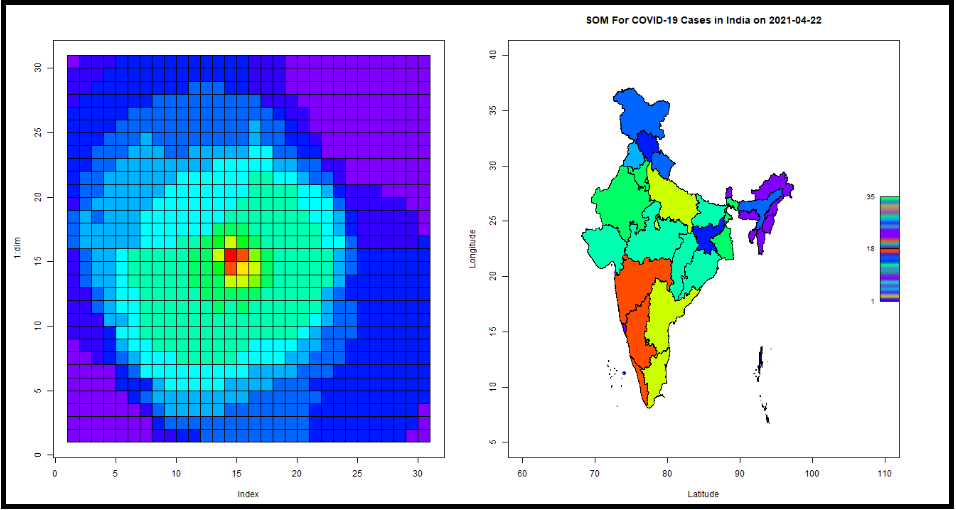

```{r setup, include=FALSE}
knitr::opts_chunk$set(echo = TRUE)
```

[Return To Home Page](Start_here.html)

```{css, echo=FALSE}
.center {
   text-align: center;
}

```

---
<div class="center">
  <h1>Module 3</h1>
  <h3>Application of SOMs in Real Life: Modelling the COVID-19 Pandemic in India</h3>
</div>

---

<div align="justify"> 

The COVID-19 pandemic has had a devastating impact across the world in the years 2020 and 2021. In an attempt to study the dynamics of the pandemic we need to analyze the number of rising cases and deaths and find patterns in the trends of the pandemic impact. But the sheer amount of data available on the pandemic makes this task difficult, as the voluminous numbers need to be reduced to concise insights for usage in real life. Out of the many approaches to dimensionality reduction, we show an implementation of self organizing maps on the COVID-19 data for India. We also present the patterns visually in the form of dynamic Self Organizing Map charts and their spatial representation using the India map. The data used in this implementation ranges from 1st March 2021 to 1st June 2021 and contains data on all the states in India as of 2021. The data has been sourced from [1] and [2].


<div class="center">

</div>


<a id="aa1"></a>

## Part 1: Loading and installing necessary libraries.

```{R echo=TRUE, fig.width=25, fig.height=40, message=FALSE, warning=FALSE }
# 1.1) Loading the necessary libraries.
suppressWarnings(library(readr))
suppressWarnings(library(dplyr))
suppressWarnings(library(rgdal))
suppressWarnings(library(sf))
suppressWarnings(library(ggplot2))
suppressWarnings(library(magick))
suppressWarnings(library(plotfunctions))
```

<a id="aa2"></a>


## Part 2: Creating the functions necessary for working of SOMs. Refer to Module 1 for learning about the same.

```{R echo=TRUE, fig.width=25, fig.height=40, message=FALSE, warning=FALSE }
#-----------------------------------------------------------------------------------------------------------------------------------------------------------------

# 2.1) A function to return the sum of squared distance between "x" and "y".

euclidean_distance <- function(x, y) {
  ret <- sqrt(sum((x - y)^2))
  return(ret)
}

#-----------------------------------------------------------------------------------------------------------------------------------------------------------------

# 2.2) Function to create a SOM grid.
# "x*y" is the number of neurons.
# "p" is the number of columns in the original data frame or number of input dimensions.

create_grid <- function(x,y,p) {
  ret <- matrix(data = rnorm(x * y * p), nrow = x * y, ncol = p)
  return(ret)
}


#-----------------------------------------------------------------------------------------------------------------------------------------------------------------

# 2.3) Function to decay the radius exponentially over time. 
# "radius" is the initial radius that is passed.
# "current_iteration" represents the current iteration.
# "time_constant" is the time constant.

decay_radius_function <- function(radius, current_iteration, time_constant) {
  ret <- radius * exp(-current_iteration / time_constant)
  return(ret)
}

#-----------------------------------------------------------------------------------------------------------------------------------------------------------------

# 2.4) Function to decay the learning rate.
# "learning_rate" is the current learning rate.
# "current_iteration" is the current iteration.
# "n_iteration" is the number of iterations.

decay_learning_rate <- function(learning_rate, current_iteration, n_iteration) {
  ret <- learning_rate * exp(-current_iteration / n_iteration)
  return(ret)
}

#-----------------------------------------------------------------------------------------------------------------------------------------------------------------

# 2.5) A function to calculate influence over neighbouring neurons.
# "distance" is the lateral distance.
# "radius" is the current neighbourhood radius.

influence_calculation <- function(distance, radius) {
  ret <- exp(-(distance^2) / (2 * (radius^2)))
  return(ret)
}


#-----------------------------------------------------------------------------------------------------------------------------------------------------------------

# 2.6) A function to return the winning neuron.
# "x" is a single row of data and input_grid is the grid.

BMU <- function(x, input_grid) { 
  distance <- 0
  min_distance <- 10000000 
  min_ind <- -1 
  for (e in 1:nrow(input_grid)) # Iterating through the grid.
  {
    distance <- euclidean_distance(x, input_grid[e, ]) # Calculating euclidean distance.
    if (distance < min_distance) {
      min_distance <- distance # Updating minimum distance for winning unit.
      min_ind <- e # Updating winning neuron.
    }
  }
  return(min_ind-1) # Returns index of BMU.
}

#-----------------------------------------------------------------------------------------------------------------------------------------------------------------

# 2.7) Faster BMU implementation.


BMU_Vectorised <- function(x, input_grid) { 
  dist_mtrx=rowSums(sweep(input_grid,2,x)^2) # Calculating the distance of the "x" row from all the neurons using matrix operations.
  min_ind=which.min(dist_mtrx) # Finding the location of the neuron with the minimum distance.
  return (min_ind-1) # Returning the zero-indexed value of the winning neuron.
}

#-----------------------------------------------------------------------------------------------------------------------------------------------------------------

# 2.8) A function to encapsulate the entire creation, working and updation of SOM over the training period.
# "x" is the input and "input_grid" is the SOM grid that will be updated iteratively.

SOM <- function(x, input_grid) {
  breaker <- 0
  n_iteration <- nrow(x) # Defining number of iterations.
  initial_learning_rate <- 0.5 # Defining initial learning rate.
  initial_radius <- 15 # Defining initial radius.
  time_constant <- n_iteration / log(initial_radius) # Initializing time constant.
  lateral_distance_points=expand.grid(1:sqrt(nrow(input_grid)),1:sqrt(nrow(input_grid))) # Initializing physical locations of neurons to figure out lateral distance.
  rows=sqrt(nrow(input_grid)) # Taking the number of rows as square root of number of entries in the grid.
  n_epochs=40 # Defining the number of epochs.
  new_radius <- initial_radius
  l <- c()
  for(ne in 1:n_epochs)
  {
    extra <- ((ne-1)*400)
    for (i in 1:n_iteration) # Looping through for training.
    {
      old_grid=input_grid
      curr_i <- extra + i
      sample_input_row <- as.vector(unlist(x[sample(1:nrow(x), size = 1, replace = F), ])) # Selecting random input row from given data set.
      new_radius <- decay_radius_function(initial_radius, curr_i, time_constant) # Decaying radius.
      new_learning_rate <- decay_learning_rate(initial_learning_rate,curr_i, n_iteration) # Decaying learning rate.
      index_temp <- BMU_Vectorised(sample_input_row, input_grid) # Finding best matching unit for given input row.
      index_new=c((as.integer(index_temp/rows)+1),(index_temp%%rows)+1) # Converting a 1D co-ordinate to a 2D co-ordinate for finding lateral distance on the map.
      lateral_distance=sqrt(abs(rowSums(sweep(lateral_distance_points,2,index_new)^2))) # Finding euclidean distance between the given best matching units and all units on the map.
      rn=which(lateral_distance<=new_radius) # Finding neurons that are within the radius of the winning unit.
      inf=influence_calculation(lateral_distance[rn],new_radius) # Calculating the influence of the winning neuron on neighbours.
      if(length(rn)!=1) # Updating multiple rows if neighbourhood is large.
      {
        # Calculating the influence of the winning neuron on neighbours.
        diff_grid=(sweep(input_grid[rn,],2,sample_input_row))*-1 # A temporary matrix that stores the difference between the data point and the weights of the winning neuron & neighbours.
        updated_weights=new_learning_rate*inf*diff_grid # The updating operation on the winning and neighbouring neurons.
        input_grid[rn,]=input_grid[rn,]+updated_weights # Now updating those grid entries that are either the winning neuron or its neighbours.
      }
      else # Updating only winning neuron.
      {
        diff_row=(input_grid[rn,]-sample_input_row)*-1 # A temporary matrix that stores the difference between the data point and the weights of the winning neuron & neighbours.
        updated_weights=new_learning_rate*inf*diff_row # The updating operation on the winning and neighbouring neurons.
        input_grid[rn,]=input_grid[rn,]+updated_weights # Now updating those grid entries that are either the winning neuron or its neighbours.
      }
      l <- c(l,euclidean_distance(old_grid,input_grid))
      if(isTRUE(all.equal(old_grid,input_grid)))
      {
        breaker <- 1
        break
      }
    }
    if(breaker ==1)
    {
      break
    }
  }
  return(list(input_grid,l)) # Returning the updated SOM weights.
}

#-------------------------------------------------------------------------------------------------------------------------------------------------
# 2.9) A function to visualize the weights of SOM.

drawGrid<- function(weight,dimension,showPlot=TRUE){
  
  # Converting to a matrix.
  weight<-as.matrix(weight, ncol = ncol(weight))
  
  norm.matrix<-NULL
  
  # Calculation of the "norm".
  for(i in 1:length(weight[,1])){
    a<-norm(weight[i,], type = "2")
    norm.matrix<-rbind(norm.matrix,a)
  }

  # Mapping to range 5 to 20.
  input_start<-min(norm.matrix)
  input_end<-max(norm.matrix)
  output_start<-5
  output_end<-20
  
  
  # Calculating wavelength based on "norm".
  color<-NULL
  for(i in 1:length(norm.matrix)){
    input = norm.matrix[i]
    output = output_start + ((output_end - output_start) / (input_end - input_start)) * (input - input_start)
    color<-rbind(color,output)
  }
  
  # Getting the colors (hex values) from the wavelength.
  color.rgb<-rainbow(20, rev = T)[color] 
  
  # Plotting the grid.
  if(showPlot){
    dim<-max(dimension)+1
    plot(1:dim, type = "n")
    
    for (i in 1:dimension[1]){
      for(j in 1:dimension[2]){
        rect(i,j,i+1,j+1, col = color.rgb[i*dimension[1]+j - dimension[1]])
      }
    }
  }
  
  return(color.rgb)
} 
```

<a id="aa3"></a>

## Part 3: Loading the data and necessary files for implementation.

For the purpose of plotting the spatial data (Indian political map) the library "sf" was used . This library provides a simple and standard way to encode spatial vector data. It binds to "rgdal" for reading and writing the data. It must be noted that "rgdal" library will be retired by the end of 2023 and all the features will then be shifted to the sf library. The COVID-19 data for India (obtained from [1] and [2]) provided us with the total number of confirmed cases, number of cured cases, current number of total infections and number of deaths all in a state wise fashion. This data was collected with a time lag of one day and the numbers were cumulative till that day, thus we obtained the number of daily infections by subtracting the numbers from the previous day’s value. 

```{R echo=TRUE, fig.width=25, fig.height=40, message=FALSE, warning=FALSE }
# 3.1)  Creating the output directory for storing SOMs.
dir.create("SOM_Maps")
dir_out <-  paste0(getwd(),"/SOM_Maps/")

# 3.2) Reading the mapping files.
isro<-st_read("Resources/cauvery-INDIA_STATE_250K.kml")
isro<-isro[-1,]

# 3.3) The COVID-19 data is available in csv format and needs pre-processing before
# it can be used in this script. Hence, the data is first processed by called the
# `Data Preprocessing.R` script, after which the final processed dataframe of COVID-19
# cases and deaths called 'covid' is obtained.
source("Resources/Data Preprocessing.R")

# 3.4) Reading the processed data.
covid <- read.csv("Resources/covid_data.csv")
head(covid)

# 3.5) Taking date, state, deaths [colnum: 8] and confirmed cases [colnum: 9].
data<-covid[,c(2,3,7,8)]

# 3.6) Formatting data for plotting.
data<-data[12207:length(data[,1]),] %>% arrange(Date,State.UnionTerritory)
average.length<-7
iteration<-0 
date.range<-seq(from = as.Date("2021/3/1"), to = as.Date("2021/6/1"),by = "day")

head(data)
```

<a id="aa4"></a>


## Part 4: Generating the Self Organizing Maps for each date and saving the plots.

Now the obtained data was reformatted and fed to the SOM model. Here we chose to train the model with a continuous 7 day moving average starting from March 1 to June 1 2021. The feature map was prepared for the weights which were returned by the model.

The color of each state was determined by passing data of that state to the BMU function applied over the trained model. Thus the index number of winning neuron was obtained. From this index we could find the position of the neuron in the 2D grid and thus its color and then color the state with the color of the winning neuron. One change in the visualization algorithm made is that it is not using a continuous color spectrum of wavelengths 360nm to 720 nm but a discrete color palette of 16 colors obtained from a continuous spectrum. So instead of using the "photobiology" library for generating continuous spectrum, the rainbow color palette from R-base was used. 

This entire process was iterated over each week until the end of data. Through this process we obtained around 90 feature maps and a corresponding map of India with states showing color clustering. Later these obtained images were stitched to obtain a gif file showing the transitions as COVID-19 infections spread and recede.


```{R echo=TRUE, fig.width=25, fig.height=40, message=FALSE, warning=FALSE }
# 4.1) Iterating over all the dates present in the data set and generating SOM for each date.
for(iteration in 0:(length(date.range)-1)){ 
  
    start<-36*iteration+1
    end<-start+36*average.length
    
    previous.range<-seq(start,start+35)
    later.range<-seq(end,end+35)
    
    week<-cbind.data.frame(Name = data[1:36,2],
                           Deaths = (data[later.range,3] - data[previous.range,3])/average.length,
                           Confirmed = (data[later.range,4] - data[previous.range,4])/average.length
    )
    
     
    # Note: Change below mentioned line to "data.set<-week_1[,-1]" if running for individual weeks.
    
    data.set<-week[,-1]  # Removing the names.
    
    
    # Creating the grid -
    # Creating a 4*4 grid using the function defined above.
    set.seed(222)
    grid <- create_grid(30,30,2)
    
    # Training the model.
    y <- SOM(data.set,grid)
    
    # These are the returned weights for 900 neurons i.e. 30X30 grid
    gridSOM <- y[1]
    
    # Saving the plot.
    path1 <- paste0(dir_out,"Week ")
    img.name<-paste0(path1,iteration+1," ",date.range[iteration+1],".png",sep = "")
    png(img.name, width = 1280, height = 720)
    par(mfrow =c(1,2))
      
    # Retrieving the weights and plotting the map.
    gridSOM<-matrix(unlist(gridSOM),ncol=2)
    color.rgb<-drawGrid(gridSOM,c(30,30),TRUE)
      
    # Showing which state corresponds to which neuron.
    index<-NULL
    for(i in 1:nrow(data.set)){
        k<-as.matrix(data.set[i,],ncol = 2)
        index<-rbind(index,c(week[i,1],BMU_Vectorised(k,gridSOM)))
      }
      
    # Removing states which are not present in the map.
    index<-rbind(index[1:8,],index[8,],index[9:36,])
    index<-index[-c(19,33),]
    index.numbers<-as.numeric(index[,2])
    color.index<-color.rgb[index.numbers]

    # Plotting the grid
    title_string <- paste0("SOM For COVID-19 Cases in India on ",date.range[iteration+1])
    plot(1:100, type ="n", xlim=c(60,110), ylim=c(5,40), xlab="Latitude", ylab="Longitude", main=title_string) 
    for(i in 1:36){
        plot(st_geometry(isro[i,]),col =color.index[i], add =TRUE)
      }
      gradientLegend(1:length(color.index),color = color.index, pos=.5, side=4,inside=TRUE)
    dev.off()
}

```

<a id="aa5"></a>


## Part 5: Generating an animated gif to combine all the plots sequentially.

```{R echo=TRUE, fig.width=25, fig.height=40, message=FALSE, warning=FALSE}
# 5.1) Obtaining all the maps in one list.
imgs <- list.files(dir_out, full.names = TRUE)
img_list <- lapply(imgs, image_read)
# 5.2) Join the images together.
img_joined <- image_join(img_list)
# 5.3) Animate at 2 frames per second.
img_animated <- image_animate(img_joined, fps = 4)
# 5.4) View animated image.
img_animated
# 5.5) Saving to disk.
image_write(image = img_animated,path = "som_map_animation.gif")
```

<a id="aa6"></a>


## Conclusion

Thus we have successfully implemented Self Organizing Maps in R for dimensionality reduction of the India's 2021 COVID-19 cases data set and have observed patterns in the number of cases and deaths over time as the pandemic crossed the country. This application was complicated to implement due to the challenge of mapping clusters off a grid on the map of India. We had to locate the latitude and longitudes of each state and map the coordinates to the respective cells corresponding to the intensity of each state. Furthermore, we realized that if multiple states had similar intensity of cases, they would appear close on the SOM grid, but could not be physically close on a map as they were geographically apart. This mapping had to account for geographical and cluster separation which was a difficult task to implement. To verify the efficacy of using SOMs for the COVID-19 data clustering, we compared our gif to the online COVID-19 graphics on outbreak intensity across India, provided by local news channels and pandemic information sources. We were pleased to observe that hotspots reported in the news and higher intensity data points in our dataset matched the clusters on our India map gif. Through our implementation of this complex algorithm for understanding a recent problem faced by our country, we would like to encourage researchers and students to help solve similar problems faced by our society through statistics and programming. We would like to promote the concept of self organizing maps and the usage of R as a programming tool for diverse multi-disciplinary applications.


</div>

## Part 6: References


